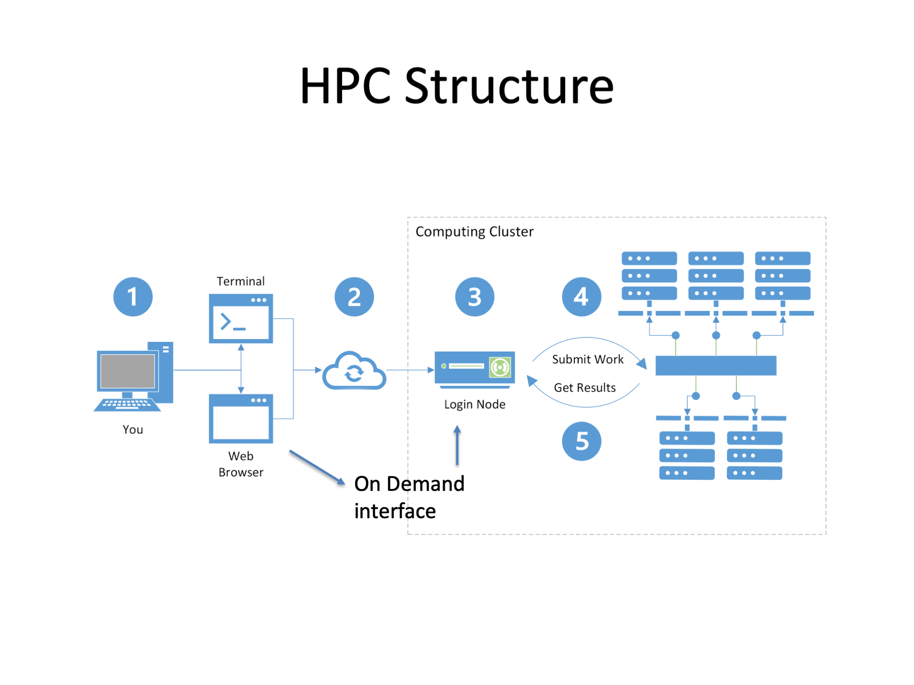

# High-Performance Computing (HPC) for Research

## Getting Ready for Hands-On

First of all, you will add your public key to the Laguna user portal.

## Introduction: HPC Resources (20 min)
Students may need high-performance computing (HPC) resources when their research or coursework involves computational tasks that exceed the capacity of a regular laptop or desktop. For example, if you’re analyzing or loading a 1–5 GB dataset in-memory (e.g., with pandas in Python), you may hit memory limits. Some empirical tests show pandas can use 2×–4× the memory compared to raw CSV size.

               ┌──────────────────────────────┐
               │ Do you work with large data? │
               │ (>1 GB or slow to process)   │
               └─────────────┬────────────────┘
                             │Yes
                             ▼
               ┌─────────────────────────────┐
               │ Does your code take >1 hour │
               │ or need many iterations?    │
               └─────────────┬───────────────┘
                             │Yes
                             ▼
               ┌─────────────────────────────┐
               │ Are you using ML, AI,       │
               │ simulations, or GPUs?       │
               └─────────────┬───────────────┘
                             │Yes
                             ▼
               ┌─────────────────────────────┐
               │      Request HPC Access     │
               └─────────────────────────────┘
                             │
                             ▼
           ┌────────────────────────────────────────────┐
           │ If no to any: Can your work finish         │
           │ faster, more efficiently, or more robustly │
           │ on HPC?                                    │
           └─────────────┬────────────────────────┬─────┘
                         │Yes                     │No
                         ▼                        ▼
           ┌──────────────────────────┐     ┌──────────────────────┐
           │     Consider HPC         │     │  Regular Computer OK │
           └──────────────────────────┘     └──────────────────────┘

- Local HPC: [QCL GPU and Dell Server](Introduction.md)
- Regional HPC Cluster: USC Laguna - https://uschpc.github.io/regional-computing-website/ (Slide #1)
- National Supercomputers: [ACCESS](https://github.com/CMC-QCL/HPC-research-computing/blob/main/Introduction.md#national-supercomputers-access)

### HPC Structure (10 min)

## How to get started with the Laguna cluster (10 min)
To get allocations from Laguna, your faculty advisor and you will be working together for the following steps.

1. Your professor (Principal Investigator, PI) requests a PI account and project on Laguna: Contact local administrator (qcl@cmc.edu) or submit a ticket to laguna-support@usc.edu to request access to Laguna. USC's CARC team will send PI a Google form to collect information for research.
2. Once USC CARC approves and provisions a PI account, PI can access the user portal at https://hpcaccount.usc.edu/
3. PI cretes a new project in the user portal if it has not created. 
4. Research Assistants find the EPPN value from https://hpcaccount.usc.edu/static/secure/incommon.php (this is your Laguna user name.)
5. PI adds student (Research Assistnat, RA) accounts to the project in the Project page.
6. Once USC CARC provisions RA accounts, RAs can access the user portal as well.

## (Remote) Research Computing Workflow
The workflow for using Laguna typically consists of the following steps:

1. Connecting to the Internet
2. Logging in to the Laguna login node
3. Organizing files
4. Transferring files
5. Installing and running software
6. Testing your job interactively on a compute node
7. Submitting your job to the job scheduler to run it remotely on a compute node
8. Monitoring your job and checking the results when it has completed

## Prerequisites for Laguna (30 min and break)
All participants should login and check their user account on the Laguna cluster.

- CARC Accoount and EPPN (user name)
 https://uschpc.github.io/regional-computing-website/user-guides/get-started-laguna.html

## Interactive Computing (30 min)
- OnDemand Apps: JupyterLab, RStudio, Code Server.
- Web Interface: [https://www.carc.usc.edu/user-guides/carc-ondemand/ondemand-overview](https://uschpc.github.io/regional-computing-website/user-guides/get-started-laguna/laguna-ondemand.html)
- Interactive Session via Shell

## Batch Computing (30 min and break)
- OnDemand Job Composer
- Shell Script
- SLURM

## Data Management (30 min)
- Data Storages
- Data Transfer

## Computing Environment (20 min)
- modules
- containers
- Shell

## HPC Demo (20 min) 

